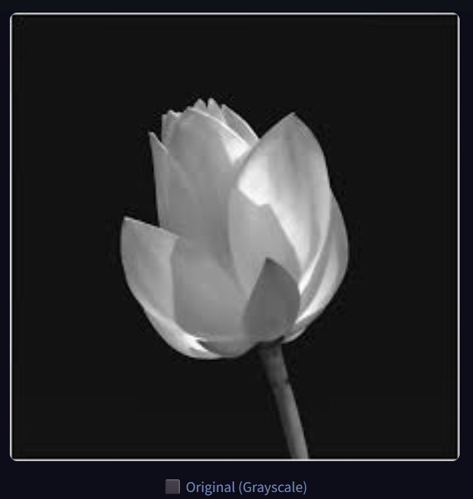
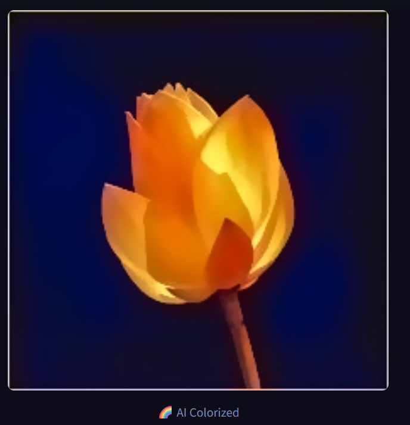

# 🎨 AI Image Colorization v2 — using Deep Learning

> **BE Final Year Mini Project — Computer Engineering (SPPU 2019 Pattern)**
> Automatically colorize black & white photographs using a pretrained CNN.
> v2 adds guided filter upsampling, vibrance boost, and tiled high-res inference.

---

## 📌 Project Overview

Based on **Zhang et al. (2016)** *"Colorful Image Colorization"* (ECCV), extended with
three practical improvements that significantly raise output quality:

| Feature | v1 | v2 |
|---|---|---|
| (a,b) channel upsampling | Bilinear resize | **Guided filter** (edge-aware) |
| Colour enhancement | None | **Vibrance boost** (non-linear) |
| High-res images | Squish to 224px | **Tiled inference** + blend |
| Floating-point precision | uint8 throughout | **float32** until final cast |
| Resize interpolation | BILINEAR | **LANCZOS4** |
| Noise reduction | None | **Bilateral filter** on output |

### Tech Stack

| Component | Library |
|---|---|
| Image processing & DNN | OpenCV (`cv2`) |
| Numerical computation | NumPy |
| Visualization | Matplotlib |
| Web interface | Streamlit |

---

## 🗂️ Project Structure

```
image-colorization-project/
│
├── models/
│   ├── colorization_deploy_v2.prototxt     # CNN architecture
│   ├── colorization_release_v2.caffemodel  # Pretrained weights (~130 MB)
│   └── pts_in_hull.npy                     # 313 colour cluster centres
│
├── src/
│   ├── colorize.py     # Core engine: guided filter, tiling, vibrance
│   └── utils.py        # I/O, visualisation, metrics, downloader
│
├── app/
│   └── app.py          # Streamlit web UI
│
├── images/
│   └── sample_bw.jpg   # Sample test image
│
├── results/            # Output images (auto-created)
├── download_models.py  # One-time model downloader
├── run_colorize.py     # CLI script
├── requirements.txt
└── README.md
```

---

## ⚙️ Setup

### 1. Prerequisites
- Python 3.9+

### 2. Create Virtual Environment
```bash
python -m venv venv
source venv/bin/activate        # macOS/Linux
venv\Scripts\activate           # Windows
```

### 3. Install Dependencies
```bash
pip install -r requirements.txt
```

### 4. Download Model Files (one-time)

Run the automated downloader:
```bash
python download_models.py
```

> ⚠️ **If the caffemodel download fails (HTTP 403/404):** The original Berkeley server is permanently offline. Use one of the manual methods below.

#### Manual Download — Option A: PowerShell (Windows)
```powershell
Invoke-WebRequest -Uri "https://huggingface.co/spaces/BilalSardar/Black-N-White-To-Color/resolve/main/colorization_release_v2.caffemodel" -OutFile "models\colorization_release_v2.caffemodel"
```

#### Manual Download — Option B: curl (macOS/Linux)
```bash
curl -L "https://huggingface.co/spaces/BilalSardar/Black-N-White-To-Color/resolve/main/colorization_release_v2.caffemodel" -o models/colorization_release_v2.caffemodel
```

#### Manual Download — Option C: Browser
Open this URL in your browser and save the file to the `models/` folder:
```
https://huggingface.co/spaces/BilalSardar/Black-N-White-To-Color/resolve/main/colorization_release_v2.caffemodel
```

After downloading, verify the file is **~128 MB**:
```powershell
# Windows PowerShell
(Get-Item models\colorization_release_v2.caffemodel).Length / 1MB
# Expected output: ~128.8
```

#### Expected models/ folder after download:
```
models/
├── colorization_deploy_v2.prototxt      ~10 KB   ✅
├── colorization_release_v2.caffemodel   ~128 MB  ✅
└── pts_in_hull.npy                      ~3 KB    ✅
```

---

## 🚀 Running the Project

### Streamlit App (recommended)
```bash
streamlit run app/app.py
```
Then open your browser at **http://localhost:8501**

### Command Line
```bash
python run_colorize.py --input images/sample_bw.jpg --show
```

---

## 🖥️ Using the App

1. Upload any black & white JPG or PNG image
2. Select a **Quality Mode** from the sidebar:
   - ⚡ **Fast** — ~0.3s, no guided filter, good for quick previews
   - ⚖️ **Balanced** — ~1–3s, default, best quality/speed tradeoff
   - 💎 **High Quality** — ~3–8s, guided filter r=16, aggressive tiling
3. Adjust **Enhancement sliders** (Vibrance, Saturation, Guided filter radius)
4. View the side-by-side comparison
5. Click **Download** to save the colorized image or comparison

---

## 🧠 v2 Pipeline — Key Improvements Explained

### 1. Guided Filter Upsampling
```
Model output: (a,b) at 224×224
        ↓  Lanczos resize to original size
        ↓  Guided filter with L channel as edge guide
Output: (a,b) at full resolution with sharp colour boundaries
```
The guided filter (He et al. 2013) finds a locally linear relationship
between the guide (L channel) and the input (a or b channel).
Where L has a strong edge, the filter stops colour from crossing it.
Where L is flat, colours blend smoothly.

### 2. Vibrance Boost (Non-linear Saturation)
```
chroma  = sqrt(a² + b²)
boost   = 1 + strength × (1 − chroma/128)²   ← stronger for grey pixels
a_new   = a × boost × sat_scale
```
Dull/grey pixels get a larger saturation lift; already-vivid pixels
are left nearly unchanged. This avoids the blown-out look of plain
saturation multiplication.

### 3. Tiled Inference
```
Image (e.g. 2000×1500)
  → split into 400×400 tiles with 64px overlap
  → each tile colorized independently
  → blend with smooth linear weight maps (1 at centre, 0 at borders)
  → sum(color × weight) / sum(weight)  →  seamless full-res output
```
Tiling lets the model process high-res images at a scale where it can
recognise local textures, faces, foliage, etc., producing richer colour.

### 4. ColorizeOptions Presets

```python
opts = ColorizeOptions.fast()         # ~0.3s — no guided filter, no tiling
opts = ColorizeOptions.balanced()     # ~1-3s — default
opts = ColorizeOptions.high_quality() # ~3-8s — r=16 guided filter, aggressive tiling
```

---

## 🛠️ Troubleshooting

| Problem | Fix |
|---|---|
| `ModuleNotFoundError: cv2` | `pip install opencv-python` |
| `FileNotFoundError: Missing model files` | Re-run `python download_models.py` or use manual download above |
| caffemodel download gives HTTP 403/404 | Use the HuggingFace manual download link above |
| Downloaded caffemodel is tiny (<1 MB) | The download failed silently — retry with curl/PowerShell |
| `streamlit: command not found` | `pip install streamlit` |
| Port 8501 already in use | `streamlit run app/app.py --server.port 8502` |
| Colorized image looks grey/dull | Increase Vibrance slider in sidebar |

---

## 📸 Screenshots (Example_)

  
  

---

## 📚 References

- Zhang, R., Isola, P., & Efros, A. A. (2016). *Colorful Image Colorization.* ECCV.
  https://arxiv.org/abs/1603.08511
- He, K., Sun, J., & Tang, X. (2013). *Guided Image Filtering.* TPAMI.
  https://ieeexplore.ieee.org/document/6319405

---

*BE Final Year Mini Project — SPPU 2019 Pattern*